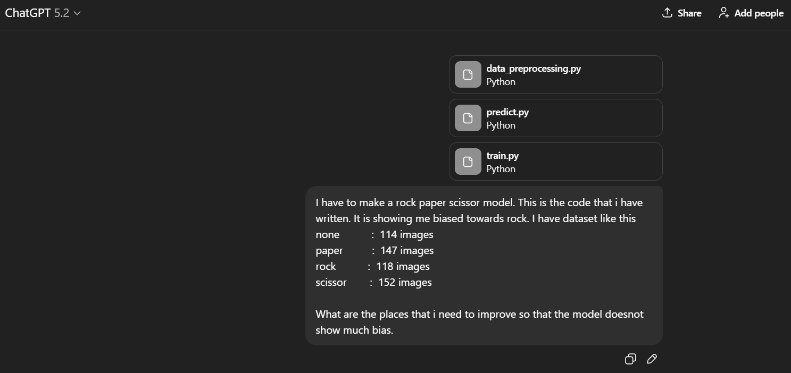
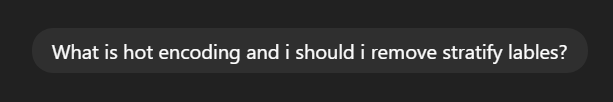
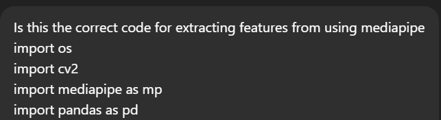
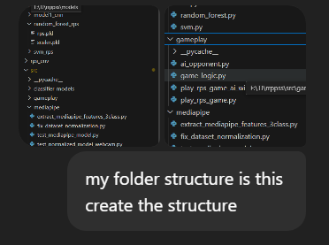
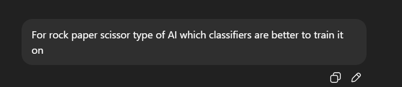

Rock Paper Scissors Hand Gesture Recognition
A real-time hand gesture recognition system using MediaPipe and Machine Learning to classify Rock, Paper, and Scissors gestures.

Installation Instructions

Prerequisites
Python 3.9 - 3.11
Webcam

Setup Steps
1. Clone this repository

2. Create a virtual environment(recommended)
    python -m venv .venv

    Activate the virtual environment
    .venv\Scripts\activate

    (Make sure the python interpreter for venv is between 3.9 - 3.11)

3. Install libraries
    pip install -r requirements.txt

4. Run the rock-paper-scissor game
    python src/gameplay/play_rps_game.py

File Organization or Structure
rps/
│
├── evaluation/
│   ├── evaluate_models.py          # CNN vs MediaPipe(Gradient Boost) evaluation
│   ├── figures/
│   │   ├── cnn_confusion.png
│   │   ├── mediapipe_confusion.png
│   │   ├── accuracy_comparison.png
│   │   └── training_curves.png
│
├── feature_extraction/
│   ├── mediapipe_features.csv
│   ├── mediapipe_features_normalized.csv
│
├── models/
│   ├── gradient_boost_rps/
│   │   ├── rps.pkl
│   │   └── scaler.pkl
│   ├── model1_cnn/
│   │   ├── best_model.keras
│   │   └── final_model.keras
│   │
│   ├── random_forest_rps/
│   │   ├── rps.pkl
│   │   └── scaler.pkl
│   │
│   ├── svm_rps/
│   │   ├── rps.pkl
│   │   └── scaler.pkl
│
├── src/
│   ├── model1/                     # CNN (image-based model)
│   │   ├── data_preprocessing.py
│   │   ├── model.py
│   │   ├── train.py
│   │   └── predict.py
│   │
│   ├── mediapipe/                  # Landmark-based pipeline
│   │   ├── extract_features.py
│   │   ├── normalize_features.py
│   │   ├── train_mediapipe.py
│   │   ├── train_normalized.py
│   │   ├── test_mediapipe_model.py
│   │   └── test_normalized_model.py
│   │
│   ├── classifier_models/          # Classical ML (experiments)
│   │   ├── random_forest.py
│   │   ├── gradient_boost.py
│   │   ├── svm.py
│   │   ├── knn.py
│   │   └── nn.py
│   │
│   ├── gameplay/
│   │   ├── game_logic.py
│   │   ├── ai_opponent.py
│   │   └── play_rps_game.py
│
├── applicationconfig.py
├── requirements.txt
├── README.md

How to use this code?
Make sure you are inside the folder **rps**

To play the rock paper scissor game run the file 
python src/gameplay/play_rps_game.py

To see gesture prediction from the first model from scratch use this command
python .\src\model1\predict.py

Inside src, both the models training and prediction code is there.
To see prediction of

Model 1 (from scratch)
**run**
python .\src\model1\predict.py     

Mediapipe Model
**run**
python .\src\mediapipe\test_mediapipe_model.py  (for prediction using model trained on non normalized features)
python .\src\mediapipe\test_normalized_model.py (for prediction using model trained on normalized features)

  

AI Declaration
Maintaining the AI Transparency Scale, I have used AI to generate the initial structure of this project. The step by step process of how to work on this project. I have used AI to refined some of my logic, concept clarification and debug errors.
Some of the AI prompts are given below. I have used chatgpt.

References
https://ai.google.dev/edge/mediapipe/solutions/vision/hand_landmarker/python#live-stream
https://scikit-learn.org/stable/modules/generated/sklearn.ensemble.GradientBoostingClassifier.html
https://scikit-learn.org/stable/modules/generated/sklearn.ensemble.RandomForestClassifier.html
https://youtu.be/a99p_fAr6e4?si=eZFu6XWAd-2YT8Xx

